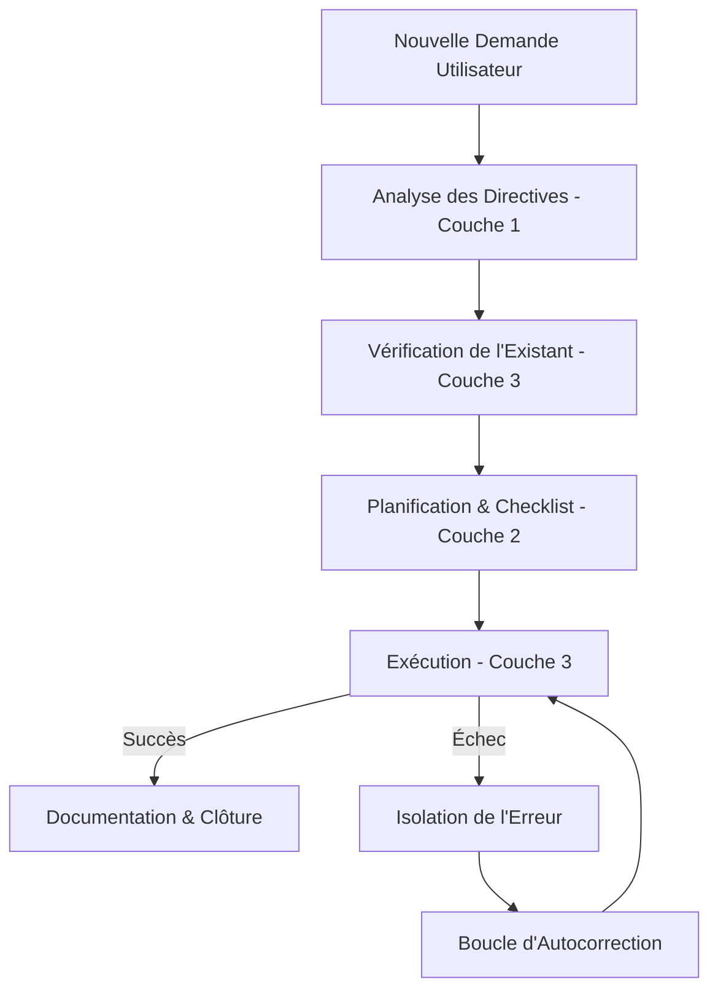

# ORCHESTRATION : Guide d'Exécution & Autocorrection (Couche 2)

Ce guide décrit les règles de routage décisionnel, de gestion des erreurs système/DBA et le processus d'apprentissage continu.

---

## 1. Processus de Décision (Orchestration Flow)

L'agent orchestrateur doit systématiquement suivre le workflow ci-dessous avant d'initier toute action sur le système :

---

## 2. Gestion des Incidents & Codes Erreurs Récurrents

En cas d'échec d'une tâche, l'orchestrateur doit intercepter et classifier le code d'erreur selon les catégories suivantes :

### A. Erreurs Oracle (ORA-XXXXX)
* **ORA-01017 (Invalid username/password) :** Arrêter immédiatement l'exécution. Vérifier l'état du Wallet Oracle ou les variables dans `.env`.
* **ORA-01555 (Snapshot too old) :** Analyser la taille de l'Undo Tablespace et la rétention. Conseiller une exécution hors pics ou optimiser la requête SQL.
* **ORA-00257 (Archiver error) :** L'espace de stockage des logs d'archive est saturé. Lancer immédiatement le script RMAN de backup et purge des archivelogs.

### B. Erreurs Système RHEL
* **Timeout Proxy (`Connection timed out` / `Could not resolve host`) :** Vérifier que les variables `http_proxy` et `https_proxy` sont correctement chargées dans la session active. Tester la connectivité via `curl -I https://registry.redhat.io`.
* **Échec de montage (VMware/NFS) :** Vérifier l'état du démon RPC (`rpcbind`) et la configuration `/etc/fstab`.

---

## 3. Boucle d'Autocorrection Persistante

1. **Capturer la cause racine :** Analyser les fichiers de log (ex: `/var/log/messages`, `alert_SID.log` d'Oracle).
2. **Corriger :** Modifier le playbook Ansible ou le script SQL défectueux.
3. **Valider :** Réexécuter la tâche dans la Couche 3.
4. **Persister l'apprentissage :** 
   - Si l'erreur est générique ou nécessite un garde-fou, ajouter une nouvelle directive dans `directives/sysadmin_rhel.md` or `directives/dba_oracle.md`.
   - Si c'est une remédiation spécifique, créer un fichier `directives/remediations/remediation_XXXX.md`.
